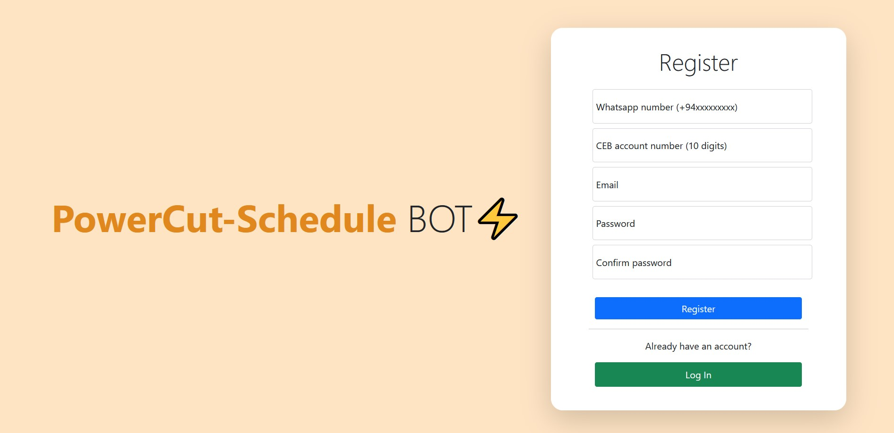
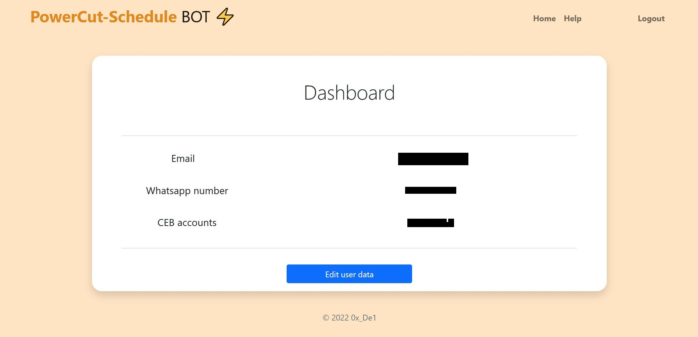
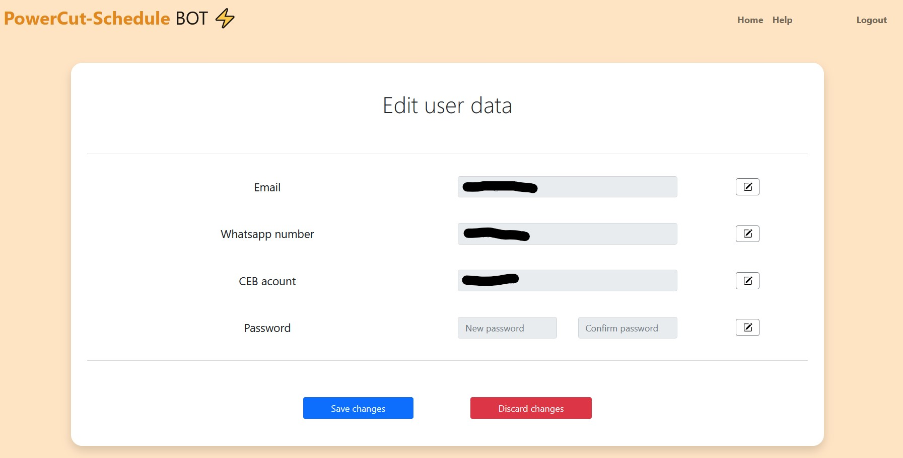

# PowerCut-Schedule BOT

## Video Demo: https://www.youtube.com/watch?v=ykFOfWuAl4Q

## Description

### These days for Sri Lankans, power cuts are part of everyday life. However,power cut schedule can vary from day to day depending on the demand management planned by the Ceylon Electricity Board (CEB).

> ### PowerCut Schedule Bot is a free web service that will notify you about the power cut times for each day via a WhatsApp message.

### Every day, we will automatically collect power cut data from [Ceylon Electricity Board (CEB)](https://cebcare.ceb.lk/) data sources for each user and send a WhatsApp message with the power cut schedule to you via the [WhatsApp Graph API](https://developers.facebook.com/docs/graph-api/reference/whats-app-business-hsm/).

# Installation:

Run app.py file to open the web app and follow the instructions below to register for the service. After you register your data will be saved in the database.

Currently main.py file needs to be manually started. But this can be instated as a cron job

# Usage Instructions:

## Registering for the service

Load the web app and click <kbd>Create new account</kbd> button. Now you will be redirected to the register page.

- Here enter WhatsApp number, CEB acccount, email and password to the relevent fields and click Register.

- If you provided valid information your account will be created & you will be redirected to the Login page.

## Viewing account details

You can login to your account with previously provided email and password.

- After login you can view your WhatsApp number, CEB acccount email in the dashboard.

## Editing account details

Click <kbd>Edit user data</kbd> button on the home page to go to the Edit user data page.

- Click on the edit icon infront of WhatsApp number, CEB acccount, email and password to enter new values.
- If you want to discard changes click on the <kbd>Discard changes</kbd> button.
- After entering the new values click on <kbd>Save changes</kbd> button to change the data.

## Project Files/Folders:

<kbd>static</kbd>: Contains CSS, and images required for the flask web app

<kbd>templates</kbd>: Contains all html files of the web app

> - **index.html:** Dashboard for showing user data
> - **settings.html:** Page to edit user data
> - **login.html:** Page to enter login information.
> - **register.html:** Page to register as a new user.
> - **help.html:** Web service usage guide.
> - **layout.html:** Contains basic html layout.
> - **error_messege.html:** Shows error messege if invalid inputs are given.

<kbd>app.py</kbd>: Contains the routes for the flask web app.

<kbd>main.py</kbd>:

**main():**

> - Connects to database to retrive account information and user information.
> - Uses `get_outage_data()` to collect outage details for each account.
> - Loops through outage data and for each account and uses `create_messege_object()` to create json object for GRAPH API.
> - Uses `send_messege(json_object)` to send messege to each user

**start_webdriver():**

> - Starts a headless chromium webdriver with `selenium` and `webdriver_manager` modules

**get_outage_data (accounts):**

> - Uses `start_webdriver()` to start a webdriver
> - Go to `"https://cebcare.ceb.lk/Incognito/OutageMap"`
> - Uses `selenium` to navigate the webpage and submit CEB account numbers and fetch power cut data
> - Repeat the above step for all unique ceb accounts and store data.
> - Close the web driver

**create_messege_object (date, phone, schedule):**

> - Function is run for each user
> - Creates Graph API JSON messege object for each user according to the power cut data provided

**send_messege(messege_object):**

> - os.environ is used to retrive `whatsapp_access_token` and `whatsapp_phone_id` from environment variables
> - Uses `requests` module to submit a post request to meta Graph API with the message object.
